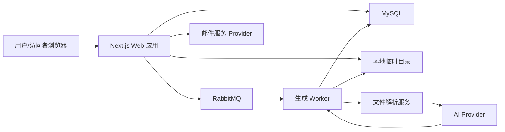
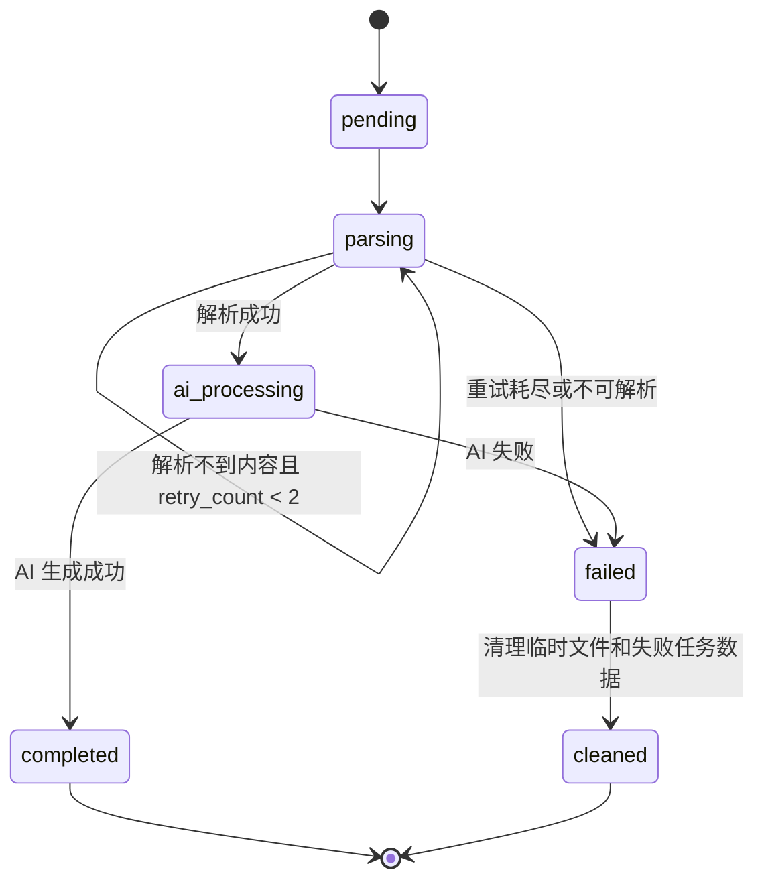
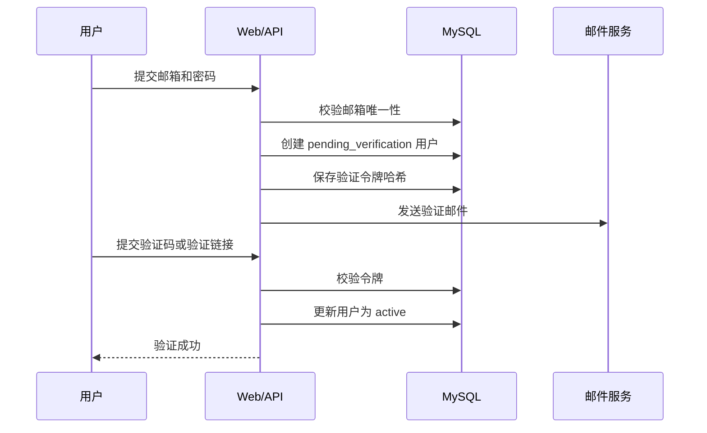
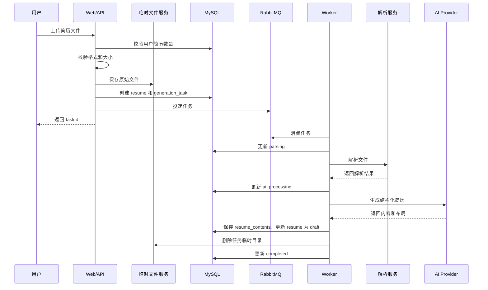

# 在线简历生成工具详细设计文档

## 1. 文档目的

本文档基于 `doc/proposal.md`、`doc/high-level-design.md` 以及已确认的补充约束，描述在线简历生成工具的详细设计。

本文档覆盖：

- 技术栈与服务边界。
- 模块详细职责。
- API 路由设计。
- 数据库表结构。
- 核心数据 Schema。
- 任务状态机与异步处理流程。
- 安全、隐私与异常处理。
- 模块级测试与集成测试方案。

## 2. 已确认设计约束

### 2.1 产品约束

- 用户使用邮箱注册和登录。
- 注册需要邮箱验证码或邮件验证。
- 支持密码找回。
- 支持上传 `.doc`、`.docx`、`.pdf` 简历文件。
- 单个上传文件大小上限为 15MB。
- 每个用户最多保留 3 份简历记录。
- 删除历史记录后允许重新上传新的简历。
- 上传失败记录不保留。
- 不支持扫描版 PDF 或图片型 PDF 的 OCR。
- 原始上传文件不长期保存。
- 解析不到内容时允许重试 2 次，仍失败则删除原始文件和本次失败任务数据。
- AI 不得虚构学历、公司、岗位、项目、证书、工作年限等事实性经历。
- 在线编辑器支持撤销、重做和富文本编辑。
- 首期不允许用户切换模板。
- 首期不保存编辑历史或版本回退。
- 在线简历链接支持公开访问、私密链接访问和密码访问。
- 密码访问模式下，不支持访问会话缓存；访问者每次访问需要输入密码。
- 用户不删除简历时，在线链接永久有效。
- 删除简历记录后，对应在线链接失效。
- 首期暂不统计在线简历访问次数。
- 需要隐私政策和用户协议页面。
- 首期不设置单份简历生成目标耗时。

### 2.2 技术约束

- 主要开发语言：TypeScript。
- Web 框架：Next.js。
- 数据库：MySQL。
- 队列：RabbitMQ 优先；如部署或运维受限，可使用 Redis 队列作为次选替代。
- 临时文件存储：本地临时目录。
- AI 服务：OpenAI API 优先，并通过 Provider 接口隔离。
- `.doc` 解析：优先使用 LibreOffice headless 转换为 `.docx` 后解析。
- `.docx` 解析：优先使用 Mammoth 提取语义化 HTML、文本、图片和表格；必要时结合 OOXML 解析补充结构。
- 文本型 PDF 解析：优先使用 pdf.js 体系提取文本、页码、坐标和基础布局线索。
- 样式保留边界：保留可解析图片和表格结构；复杂样式转换为网页模板可表达的样式，不保证 1:1 还原。

## 3. 总体架构

系统采用 Web 应用、异步任务 Worker、本地临时文件存储、MySQL 数据库和 RabbitMQ 队列组成。



### 3.1 服务组成

| 服务 | 职责 |
| --- | --- |
| Next.js Web 应用 | 页面渲染、API 路由、账号、上传、编辑、历史记录、在线访问 |
| 生成 Worker | 消费生成任务，执行文件解析、AI 处理、结果落库和清理 |
| MySQL | 持久化用户、简历、内容、链接、任务、验证码和重置令牌 |
| RabbitMQ | 承载解析与 AI 生成任务的异步调度 |
| 本地临时目录 | 短期保存原始上传文件和解析阶段的中间文件 |
| 邮件服务 Provider | 发送邮箱验证和密码找回邮件 |
| AI Provider | 执行结构识别、文案优化、合理补全和排版方案生成 |

### 3.2 目录建议

```text
src/
  app/
    api/
    auth/
    dashboard/
    editor/
    r/
    legal/
  components/
  server/
    auth/
    upload/
    parser/
    ai/
    resume/
    links/
    queue/
    mail/
    temp-files/
  worker/
  types/
  utils/
```

说明：

- `app/api` 只负责 HTTP 入参、出参和认证上下文组装。
- `server/*` 放置可测试的业务服务，避免业务逻辑散落在路由中。
- `worker` 只负责消费任务和编排服务，不直接处理页面逻辑。
- `types` 存放前后端共享的简历结构化类型和枚举。

## 4. 模块详细设计

### 4.1 账号认证模块

#### 职责

- 邮箱注册。
- 邮箱验证码或邮件验证。
- 邮箱登录。
- 退出登录。
- 密码找回。
- 用户身份状态保持。
- 所有后台接口的用户身份校验。
- 简历所有权校验。

#### 认证流程

注册流程：

1. 用户提交邮箱和密码。
2. 系统校验邮箱格式、密码强度和邮箱唯一性。
3. 系统创建未验证用户或预注册记录。
4. 系统生成邮箱验证码或邮件验证令牌。
5. 系统发送验证邮件。
6. 用户完成验证后，账号状态变为 `active`。
7. 用户可登录系统。

登录流程：

1. 用户提交邮箱和密码。
2. 系统校验用户存在、账号已验证且未禁用。
3. 系统校验密码哈希。
4. 系统创建登录会话。
5. 前端进入上传页或历史记录页。

密码找回流程：

1. 用户提交邮箱。
2. 系统生成一次性重置令牌。
3. 系统发送密码重置邮件。
4. 用户通过链接进入重置页面。
5. 系统校验令牌有效性和过期时间。
6. 用户提交新密码。
7. 系统更新密码哈希，并作废该令牌。

#### 密码策略

- 密码只保存不可逆哈希。
- 建议使用 `argon2id`；如运行环境不支持，可使用 `bcrypt`。
- 密码最小长度建议为 8 位。
- 密码找回令牌只保存哈希值，不保存明文令牌。

#### 会话策略

- 后台管理、上传、编辑、历史记录接口需要登录态。
- 在线简历访问页面不使用后台登录态判断访问权限。
- 会话 Cookie 使用 `HttpOnly`、`Secure`、`SameSite=Lax`。

#### 可独立测试点

- 邮箱格式、密码强度、邮箱唯一性校验。
- 邮箱验证令牌生成、过期、重复使用。
- 密码哈希校验。
- 密码找回令牌生成、过期、作废。
- 未登录访问受保护接口时返回 401。
- 非所有者访问简历编辑接口时返回 403。

### 4.2 用户协议与隐私页面模块

#### 职责

- 提供用户协议页面。
- 提供隐私政策页面。
- 在注册页和必要操作入口展示协议链接。

#### 页面路由

| 页面 | 路由 |
| --- | --- |
| 用户协议 | `/legal/terms` |
| 隐私政策 | `/legal/privacy` |

#### 隐私政策需要覆盖的内容

- 简历文件上传用途。
- 原始文件临时保存和删除规则。
- AI 服务使用规则。
- 在线链接访问模式。
- 删除简历记录后的数据和链接处理。
- 不支持一键删除所有数据的首期范围说明。

#### 可独立测试点

- 页面可匿名访问。
- 注册页存在用户协议和隐私政策入口。
- 页面内容更新不影响账号、上传和编辑模块。

### 4.3 文件上传模块

#### 职责

- 接收 `.doc`、`.docx`、`.pdf` 文件。
- 校验文件大小不超过 15MB。
- 校验文件扩展名和 MIME 类型。
- 校验当前用户未删除简历记录数量少于 3。
- 写入本地临时目录。
- 创建简历记录和生成任务。
- 投递生成任务到 RabbitMQ。
- 上传失败时不保留失败记录。

#### 上传校验

| 校验项 | 规则 |
| --- | --- |
| 登录态 | 必须登录 |
| 文件数量 | 单次上传 1 个文件 |
| 文件格式 | `.doc`、`.docx`、`.pdf` |
| 文件大小 | 小于或等于 15MB |
| 用户记录数 | 未删除简历记录少于 3 |
| 文件名 | 服务端生成存储名，原始文件名只作为元数据保存 |

#### 临时文件路径规则

```text
/tmp/online-resume/
  uploads/
    {userId}/
      {taskId}/
        original.{ext}
        converted.docx
        assets/
```

说明：

- 实际根目录通过环境变量 `TEMP_UPLOAD_ROOT` 配置。
- 目录名使用系统生成的 ID，不直接使用用户输入。
- 上传完成后，临时文件路径写入生成任务。
- 任务完成、失败或重试耗尽后由文件清理模块删除整个任务目录。

#### 上传成功后的行为

1. 创建 `resumes` 记录，状态为 `generating`。
2. 创建 `generation_tasks` 记录，状态为 `pending`。
3. 保存文件到临时目录。
4. 向 RabbitMQ 投递任务消息。
5. 返回 `resumeId`、`taskId` 和任务状态查询地址。

#### 可独立测试点

- 超过 15MB 被拒绝。
- 不支持格式被拒绝。
- 未登录上传被拒绝。
- 已有 3 份简历记录时上传被拒绝。
- 上传失败时不新增简历记录和任务记录。
- 上传成功后文件写入临时目录，任务被创建。

### 4.4 临时文件存储模块

#### 职责

- 保存原始上传文件。
- 保存 `.doc` 转换后的 `.docx` 文件。
- 保存解析出的临时图片资源。
- 提供读取、写入、删除接口。
- 防止路径穿越。

#### 服务接口

```ts
interface TempFileService {
  createTaskDir(input: { userId: string; taskId: string }): Promise<string>;
  saveOriginal(input: {
    taskDir: string;
    fileName: string;
    content: Buffer;
  }): Promise<TempFileRef>;
  getTaskDir(input: { userId: string; taskId: string }): string;
  removeTaskDir(input: { userId: string; taskId: string }): Promise<void>;
}
```

#### 安全规则

- 所有读写路径必须位于 `TEMP_UPLOAD_ROOT` 下。
- 删除操作只允许删除任务目录，不接受任意路径。
- 原始文件不对外提供 URL。
- 解析出的图片如果需要保留到在线简历，必须复制或转换为持久化资源引用；首期可保存为简历内容内的受控资源数据，不继续依赖原始临时目录。

#### 可独立测试点

- 路径穿越字符串无法逃逸根目录。
- 任务目录创建、写入、读取、删除。
- 删除不存在目录时不影响其他任务。

### 4.5 生成任务队列模块

#### 职责

- 投递生成任务。
- 保存任务状态。
- 支持 Worker 消费。
- 支持解析不到内容时重试 2 次。
- 支持失败终态和清理触发。
- 为前端提供进度查询数据。

#### RabbitMQ 设计

| 项 | 设计 |
| --- | --- |
| Exchange | `resume.generation` |
| Queue | `resume.generation.tasks` |
| Routing Key | `generation.requested` |
| 消息持久化 | 开启 |
| 队列持久化 | 开启 |
| Worker 并发 | 通过实例数和 prefetch 控制 |
| Ack 策略 | 处理成功后 ack；可重试异常 nack/requeue 或重新投递；终态失败 ack |

消息体：

```ts
type GenerationTaskMessage = {
  taskId: string;
  resumeId: string;
  userId: string;
  attempt: number;
  reason: "initial" | "retry_parse_empty";
};
```

#### Redis 替代方案

如 RabbitMQ 暂不可用，可使用 Redis 队列实现相同接口。

```ts
interface GenerationQueue {
  publish(message: GenerationTaskMessage): Promise<void>;
  consume(handler: (message: GenerationTaskMessage) => Promise<void>): Promise<void>;
}
```

业务服务只依赖 `GenerationQueue` 接口，不直接依赖 RabbitMQ 或 Redis 的 SDK。

#### 任务状态

| 状态 | 含义 |
| --- | --- |
| `pending` | 等待 Worker 处理 |
| `parsing` | 正在解析文件 |
| `ai_processing` | 正在进行 AI 内容处理 |
| `completed` | 生成完成 |
| `failed` | 生成失败 |
| `cleaned` | 失败任务数据和临时文件已清理 |

#### 状态机



#### 进度展示映射

| 任务状态 | 前端提示 |
| --- | --- |
| `pending` | 已提交，等待处理 |
| `parsing` | 正在解析简历文件 |
| `ai_processing` | 正在优化内容并生成在线排版 |
| `completed` | 生成完成 |
| `failed` | 生成失败，请重新上传或更换文件 |

#### 可独立测试点

- 任务消息可正确投递。
- Worker 成功处理后 ack。
- 解析不到内容时最多重试 2 次。
- 重试耗尽后任务进入失败终态。
- 失败终态触发文件清理。
- 业务层不依赖具体队列实现。

### 4.6 文件解析模块

#### 职责

- 识别上传文件类型。
- `.doc` 转换为 `.docx`。
- `.docx` 提取文本、语义化 HTML、图片、表格和基础结构。
- 文本型 PDF 提取文本、页码、坐标和基础布局线索。
- 不执行 OCR。
- 输出给 AI 使用的解析结果。
- 当解析不到有效内容时返回可重试错误。

#### 解析工具设计

| 文件类型 | 方案 | 说明 |
| --- | --- | --- |
| `.doc` | LibreOffice headless 转 `.docx` | 对旧版 Word 兼容性较好，但转换结果受原文件复杂度影响 |
| `.docx` | Mammoth + OOXML 辅助解析 | Mammoth 适合生成简洁 HTML，支持标题、列表、表格、图片、链接和常见文本样式 |
| `.pdf` | pdf.js 体系 | 适合文本型 PDF 的文字、页码、坐标和布局线索提取，不处理图片型 PDF OCR |

#### `.doc` 处理

1. Worker 调用 LibreOffice headless。
2. 将 `original.doc` 转换为 `converted.docx`。
3. 转换成功后进入 `.docx` 解析流程。
4. 转换失败时记录错误原因，任务进入失败或重试流程。

建议命令形态：

```bash
soffice --headless --convert-to docx --outdir {taskDir} {originalDocPath}
```

#### `.docx` 处理

输出内容：

- 纯文本。
- 语义化 HTML。
- 图片资源列表。
- 表格结构。
- 标题和段落。
- 列表、链接、加粗、斜体、下划线等富文本线索。

复杂样式处理：

- 字体、字号、颜色、边距等复杂样式不做 1:1 保留。
- 可转换为固定模板支持的样式变量。
- 无法识别的样式不进入 AI 事实内容，避免影响事实判断。

#### PDF 处理

输出内容：

- 页码。
- 文本块。
- 文本块坐标。
- 文本块顺序。
- 基础行段关系。

扫描版 PDF 判断：

- 所有页面文本项为空，或有效文本长度低于阈值时，判定为无有效文本。
- 不触发 OCR。
- 进入解析重试；重试耗尽后失败。

#### 解析结果 Schema

```ts
type ParsedResumeDocument = {
  source: {
    fileType: "doc" | "docx" | "pdf";
    originalFileName: string;
    fileSize: number;
  };
  plainText: string;
  semanticHtml?: string;
  blocks: ParsedBlock[];
  tables: ParsedTable[];
  assets: ParsedAsset[];
  warnings: ParserWarning[];
};

type ParsedBlock = {
  id: string;
  type: "heading" | "paragraph" | "list" | "table" | "image" | "unknown";
  text?: string;
  level?: number;
  page?: number;
  bbox?: {
    x: number;
    y: number;
    width: number;
    height: number;
  };
  marks?: Array<"bold" | "italic" | "underline" | "link">;
};

type ParsedTable = {
  id: string;
  rows: Array<Array<{ text: string; colspan?: number; rowspan?: number }>>;
};

type ParsedAsset = {
  id: string;
  kind: "image";
  mimeType: string;
  width?: number;
  height?: number;
  tempPath: string;
};

type ParserWarning = {
  code:
    | "DOC_CONVERTED"
    | "STYLE_LOSS"
    | "PDF_TEXT_ORDER_UNCERTAIN"
    | "LOW_TEXT_CONFIDENCE"
    | "UNSUPPORTED_COMPLEX_ELEMENT";
  message: string;
};
```

#### 可独立测试点

- `.doc` 能调用转换流程并继续解析。
- `.docx` 能提取标题、段落、列表、表格和图片。
- 文本型 PDF 能提取有效文本。
- 扫描版 PDF 或纯图片 PDF 被判定为无有效文本。
- 有效文本为空时返回可重试错误。
- 复杂样式不影响事实内容提取。

### 4.7 AI 内容处理模块

#### 职责

- 根据解析结果识别简历结构。
- 优化简历措辞。
- 基于已有内容合理补全表达。
- 标记不确定内容。
- 生成适合网页渲染的结构化简历数据。
- 生成固定模板体系下的排版方案。
- 保持 AI Provider 可替换。

#### AI Provider 接口

```ts
interface ResumeAiProvider {
  generateResume(input: ResumeAiInput): Promise<ResumeAiOutput>;
}

type ResumeAiInput = {
  parsedDocument: ParsedResumeDocument;
  constraints: {
    noFabrication: true;
    markUncertainContent: true;
    fixedTemplateOnly: true;
    preserveParsedImagesAndTables: true;
  };
};

type ResumeAiOutput = {
  resume: ResumeContent;
  layout: ResumeLayout;
  confirmationItems: ConfirmationItem[];
  aiWarnings: AiWarning[];
};
```

#### AI 约束提示原则

系统提示必须明确：

- 不得虚构学历、公司、岗位、项目、证书、工作年限等事实。
- 不得把推测内容写成已确认事实。
- 可以优化措辞、调整语序、提升专业表达。
- 只能基于已有信息补全非事实性表达。
- 不确定内容必须进入 `confirmationItems`。
- 输出必须符合结构化 Schema。

#### AI 输出校验

AI 返回后必须经过服务端校验：

- JSON 结构合法。
- 必填字段存在。
- 模块类型合法。
- 模块顺序引用的模块 ID 存在。
- 不确定项引用的字段路径存在。
- 文本长度在合理范围内。
- 不允许出现与解析内容明显无关的大段新事实。

校验失败处理：

1. 记录 AI 输出校验错误。
2. 如属于格式错误，可重试 AI 调用一次。
3. 重试仍失败时任务进入 `failed`。

#### 可独立测试点

- Provider 接口可使用 Mock 测试。
- AI 输出格式校验。
- 不确定项字段路径校验。
- 禁止新增关键事实的后置检查。
- AI 调用失败时任务进入失败状态。

### 4.8 简历数据模块

#### 职责

- 保存 AI 生成后的结构化简历数据。
- 保存用户编辑后的最终内容。
- 保存富文本内容、模块顺序、样式和布局数据。
- 保存 AI 待确认项。
- 维护简历与用户、任务、在线链接之间的关系。
- 不保存原始上传文件。

#### 简历状态

| 状态 | 含义 |
| --- | --- |
| `generating` | 已上传，正在生成 |
| `draft` | 生成完成，可编辑但未发布 |
| `published` | 已保存并生成在线链接 |
| `deleted` | 用户已删除 |

#### 结构化内容 Schema

```ts
type ResumeContent = {
  schemaVersion: 1;
  title: string;
  sections: ResumeSection[];
  moduleOrder: string[];
  assets: ResumeAsset[];
  confirmationItems: ConfirmationItem[];
};

type ResumeSection =
  | ProfileSection
  | EducationSection
  | WorkExperienceSection
  | ProjectSection
  | SkillSection
  | CertificateSection
  | HonorSection
  | CustomSection;

type BaseSection = {
  id: string;
  type:
    | "profile"
    | "education"
    | "work_experience"
    | "project"
    | "skill"
    | "certificate"
    | "honor"
    | "custom";
  title: string;
  visible: boolean;
};

type RichText = {
  format: "html";
  html: string;
  plainText: string;
};

type ProfileSection = BaseSection & {
  type: "profile";
  data: {
    name?: string;
    headline?: string;
    email?: string;
    phone?: string;
    location?: string;
    links?: Array<{ label: string; url: string }>;
    avatarAssetId?: string;
    summary?: RichText;
  };
};

type EducationSection = BaseSection & {
  type: "education";
  items: Array<{
    id: string;
    school?: string;
    degree?: string;
    major?: string;
    startDate?: string;
    endDate?: string;
    description?: RichText;
  }>;
};

type WorkExperienceSection = BaseSection & {
  type: "work_experience";
  items: Array<{
    id: string;
    company?: string;
    role?: string;
    startDate?: string;
    endDate?: string;
    description?: RichText;
  }>;
};

type ProjectSection = BaseSection & {
  type: "project";
  items: Array<{
    id: string;
    name?: string;
    role?: string;
    startDate?: string;
    endDate?: string;
    description?: RichText;
    links?: Array<{ label: string; url: string }>;
  }>;
};

type SkillSection = BaseSection & {
  type: "skill";
  groups: Array<{
    id: string;
    name?: string;
    skills: string[];
  }>;
};

type CertificateSection = BaseSection & {
  type: "certificate";
  items: Array<{
    id: string;
    name?: string;
    issuer?: string;
    issuedAt?: string;
    description?: RichText;
  }>;
};

type HonorSection = BaseSection & {
  type: "honor";
  items: Array<{
    id: string;
    name?: string;
    issuer?: string;
    issuedAt?: string;
    description?: RichText;
  }>;
};

type CustomSection = BaseSection & {
  type: "custom";
  content: RichText;
};

type ResumeAsset = {
  id: string;
  kind: "image";
  mimeType: string;
  dataRef: string;
  alt?: string;
};

type ConfirmationItem = {
  id: string;
  fieldPath: string;
  message: string;
  status: "pending" | "confirmed" | "edited" | "dismissed";
};
```

#### 布局 Schema

```ts
type ResumeLayout = {
  schemaVersion: 1;
  template: "default";
  theme: {
    fontFamily: "system" | "serif";
    accentColor: string;
    density: "compact" | "comfortable";
  };
  sectionLayout: Array<{
    sectionId: string;
    variant: "standard" | "timeline" | "tag_group" | "rich_text";
  }>;
};
```

#### 可独立测试点

- 简历状态流转。
- 内容 Schema 校验。
- 模块顺序与模块 ID 一致性。
- 删除记录后不再计入 3 份限制。
- 原始文件路径不进入持久化简历内容。

### 4.9 在线编辑模块

#### 职责

- 展示 AI 生成结果。
- 编辑个人信息、教育经历、工作经历、项目经历、技能、证书、荣誉和自定义模块。
- 新增、删除模块。
- 调整模块顺序。
- 富文本编辑，支持加粗、链接、列表。
- 支持撤销和重做。
- 展示 AI 待确认项。
- 保存编辑结果。
- 保存时创建或更新在线链接配置。

#### 编辑器实现建议

- 富文本编辑器建议使用 ProseMirror 生态或 Tiptap。
- 编辑器内部使用结构化状态，保存时转换为 `ResumeContent`。
- 撤销和重做只在前端会话内生效。
- 不保存编辑历史，不提供版本回退。

#### 保存规则

保存时服务端执行：

1. 校验用户登录态。
2. 校验简历所有权。
3. 校验简历未删除。
4. 校验内容 Schema。
5. 清理富文本 HTML，防止 XSS。
6. 保存 `resume_contents`。
7. 更新 `resumes.updated_at`。
8. 如果用户选择发布或更新链接，则更新 `resume_links`。

#### 可独立测试点

- 非所有者不能打开编辑数据。
- 富文本 HTML 被清理。
- 模块新增、删除、排序后 Schema 仍合法。
- 撤销、重做只影响前端当前会话。
- 保存后历史记录更新时间更新。

### 4.10 在线链接模块

#### 职责

- 在用户保存简历后生成在线链接。
- 支持公开访问、私密链接访问和密码访问。
- 保存访问标识和访问配置。
- 用户删除简历后使链接失效。
- 密码不明文保存。
- 不统计访问次数。

#### 访问模式

| 模式 | 枚举值 | 说明 |
| --- | --- | --- |
| 公开访问 | `public` | 知道链接或通过公开入口均可访问 |
| 私密链接访问 | `private_link` | 只有获得链接的人可以访问，不要求登录 |
| 密码访问 | `password` | 访问者每次访问都需要输入密码 |

#### 访问标识

- 使用随机不可预测 slug。
- 长度建议不低于 128 bit 随机强度。
- 不使用自增 ID 作为公开访问路径。
- 在线访问路径为 `/r/{slug}`。

#### 密码访问策略

- 访问密码只保存哈希。
- 不支持访问会话缓存。
- 每次访问密码模式链接时，服务端必须校验请求中提交的访问密码。
- 密码错误时不返回任何简历内容。

#### 可独立测试点

- slug 不可预测且唯一。
- 密码访问不保存明文密码。
- 密码访问不带密码时不返回简历内容。
- 删除简历后链接失效。
- 私密链接不要求登录。

### 4.11 在线简历访问模块

#### 职责

- 根据 `/r/{slug}` 展示最终简历页面。
- 支持桌面端和移动端阅读。
- 根据链接访问模式做访问控制。
- 不暴露编辑入口。
- 链接失效或简历删除时展示不可访问状态。

#### 访问流程

1. 访问者打开 `/r/{slug}`。
2. 系统查询 `resume_links`。
3. 若链接不存在、无效或对应简历已删除，展示不可访问状态。
4. 若模式为 `password`，要求提交访问密码。
5. 密码校验通过后读取 `resume_contents`。
6. 渲染在线简历页面。

#### 页面渲染

- 使用 `ResumeContent` 和 `ResumeLayout` 渲染。
- 只使用固定模板 `default`。
- 桌面端和移动端采用响应式布局。
- 不展示编辑按钮、后台路由或用户管理信息。

#### 可独立测试点

- 无效 slug 展示不可访问状态。
- 删除简历展示不可访问状态。
- 密码模式下不提交密码不展示内容。
- 密码错误不展示内容。
- 公开和私密链接可匿名访问。

### 4.12 历史记录模块

#### 职责

- 展示登录用户自己的简历历史记录。
- 展示简历标题、创建时间、最近更新时间、在线链接和编辑入口。
- 限制最多保留 3 个未删除简历记录。
- 支持用户删除历史记录。
- 删除后允许重新上传。
- 删除记录时使在线链接失效。
- 不提供版本回退。

#### 删除策略

首期采用软删除：

- `resumes.status` 更新为 `deleted`。
- `resumes.deleted_at` 写入删除时间。
- `resume_links.is_active` 更新为 `false`。
- 历史记录列表不展示已删除记录。
- 上传数量限制只统计未删除记录。

说明：

- 软删除便于处理误操作和审计，但首期不向用户提供恢复能力。
- 原始上传文件不会因为软删除而保留，因为生成流程结束时已经删除。

#### 可独立测试点

- 用户只能看到自己的记录。
- 已删除记录不展示。
- 删除记录后链接失效。
- 删除记录后可重新上传到 3 份上限内。

### 4.13 文件清理模块

#### 职责

- 生成成功后删除原始上传文件和任务临时目录。
- AI 失败后删除原始上传文件和任务临时目录。
- 解析不到内容且重试 2 次后，删除原始文件和本次失败任务数据。
- 防止原始文件长期保存。

#### 清理触发点

| 场景 | 行为 |
| --- | --- |
| 生成完成 | 删除任务临时目录，任务保留为 `completed` |
| AI 处理失败 | 删除任务临时目录，任务标记为 `failed` |
| 解析重试耗尽 | 删除任务临时目录，删除失败简历记录和失败任务数据，或将任务标记为 `cleaned` 后不对用户展示 |
| 上传接口失败 | 删除已写入的部分临时文件，不创建记录 |

#### 可独立测试点

- 成功任务清理临时目录。
- 失败任务清理临时目录。
- 重试耗尽后不保留用户可见失败记录。
- 清理失败时可再次执行，不影响其他任务目录。

## 5. API 路由设计

### 5.1 通用约定

#### 响应格式

```ts
type ApiResponse<T> =
  | { ok: true; data: T }
  | { ok: false; error: { code: string; message: string } };
```

#### 常见错误码

| 错误码 | 含义 |
| --- | --- |
| `UNAUTHENTICATED` | 未登录 |
| `FORBIDDEN` | 无权限 |
| `VALIDATION_ERROR` | 参数错误 |
| `FILE_TOO_LARGE` | 文件超过 15MB |
| `UNSUPPORTED_FILE_TYPE` | 文件格式不支持 |
| `RESUME_LIMIT_REACHED` | 已达到 3 份简历限制 |
| `TASK_NOT_FOUND` | 任务不存在 |
| `RESUME_NOT_FOUND` | 简历不存在 |
| `LINK_NOT_FOUND` | 链接不存在 |
| `LINK_INACTIVE` | 链接已失效 |
| `ACCESS_PASSWORD_REQUIRED` | 需要访问密码 |
| `ACCESS_PASSWORD_INVALID` | 访问密码错误 |
| `GENERATION_FAILED` | 生成失败 |

### 5.2 账号 API

| 方法 | 路由 | 登录 | 说明 |
| --- | --- | --- | --- |
| `POST` | `/api/auth/register` | 否 | 注册账号并发送验证邮件 |
| `POST` | `/api/auth/verify-email` | 否 | 校验邮箱验证码或验证令牌 |
| `POST` | `/api/auth/login` | 否 | 邮箱密码登录 |
| `POST` | `/api/auth/logout` | 是 | 退出登录 |
| `GET` | `/api/auth/me` | 是 | 获取当前用户 |
| `POST` | `/api/auth/forgot-password` | 否 | 发送密码找回邮件 |
| `POST` | `/api/auth/reset-password` | 否 | 重置密码 |

### 5.3 上传与任务 API

| 方法 | 路由 | 登录 | 说明 |
| --- | --- | --- | --- |
| `POST` | `/api/resumes/upload` | 是 | 上传简历文件并创建生成任务 |
| `GET` | `/api/generation-tasks/{taskId}` | 是 | 查询任务状态和进度 |

上传响应：

```ts
type UploadResumeResponse = {
  resumeId: string;
  taskId: string;
  status: "pending";
};
```

任务查询响应：

```ts
type GenerationTaskResponse = {
  taskId: string;
  resumeId: string;
  status: "pending" | "parsing" | "ai_processing" | "completed" | "failed";
  retryCount: number;
  errorMessage?: string;
};
```

### 5.4 简历编辑 API

| 方法 | 路由 | 登录 | 说明 |
| --- | --- | --- | --- |
| `GET` | `/api/resumes` | 是 | 获取历史记录列表 |
| `GET` | `/api/resumes/{resumeId}` | 是 | 获取编辑所需完整数据 |
| `PUT` | `/api/resumes/{resumeId}` | 是 | 保存编辑内容 |
| `DELETE` | `/api/resumes/{resumeId}` | 是 | 删除简历记录 |

保存请求：

```ts
type SaveResumeRequest = {
  content: ResumeContent;
  layout: ResumeLayout;
};
```

### 5.5 在线链接 API

| 方法 | 路由 | 登录 | 说明 |
| --- | --- | --- | --- |
| `PUT` | `/api/resumes/{resumeId}/link` | 是 | 创建或更新在线链接配置 |
| `GET` | `/api/resumes/{resumeId}/link` | 是 | 获取当前简历链接配置 |
| `POST` | `/api/public-links/{slug}/verify-password` | 否 | 校验访问密码并返回可渲染数据 |

链接配置请求：

```ts
type UpdateResumeLinkRequest = {
  accessMode: "public" | "private_link" | "password";
  password?: string;
};
```

说明：

- `accessMode = "password"` 时必须提交 `password`。
- `accessMode` 从 `password` 改为其他模式时，应清空密码哈希。
- 密码访问不设置访问会话缓存。

### 5.6 在线访问页面路由

| 页面 | 路由 | 登录 | 说明 |
| --- | --- | --- | --- |
| 在线简历页 | `/r/{slug}` | 否 | 展示在线简历 |
| 密码输入页 | `/r/{slug}` | 否 | 密码模式下同一路由展示密码表单 |

## 6. 数据库设计

### 6.1 设计约定

- 数据库使用 MySQL。
- 主键使用字符串 ID，建议 UUID 或 ULID。
- 时间字段使用 UTC 时间。
- JSON 字段用于保存结构化简历内容和布局。
- 所有涉及用户数据的查询必须带 `user_id` 或所有权校验。
- 删除简历记录使用软删除。

### 6.2 `users`

保存用户账号。

| 字段 | 类型 | 约束 | 说明 |
| --- | --- | --- | --- |
| `id` | `varchar(36)` | PK | 用户 ID |
| `email` | `varchar(255)` | unique, not null | 邮箱 |
| `password_hash` | `varchar(255)` | not null | 密码哈希 |
| `status` | `varchar(32)` | not null | `pending_verification`、`active`、`disabled` |
| `email_verified_at` | `datetime` | nullable | 邮箱验证时间 |
| `created_at` | `datetime` | not null | 创建时间 |
| `updated_at` | `datetime` | not null | 更新时间 |
| `last_login_at` | `datetime` | nullable | 最近登录时间 |

索引：

- `uniq_users_email(email)`。

### 6.3 `email_verification_tokens`

保存邮箱验证令牌或验证码。

| 字段 | 类型 | 约束 | 说明 |
| --- | --- | --- | --- |
| `id` | `varchar(36)` | PK | 记录 ID |
| `user_id` | `varchar(36)` | index, not null | 用户 ID |
| `token_hash` | `varchar(255)` | not null | 验证令牌哈希 |
| `expires_at` | `datetime` | not null | 过期时间 |
| `used_at` | `datetime` | nullable | 使用时间 |
| `created_at` | `datetime` | not null | 创建时间 |

### 6.4 `password_reset_tokens`

保存密码找回令牌。

| 字段 | 类型 | 约束 | 说明 |
| --- | --- | --- | --- |
| `id` | `varchar(36)` | PK | 记录 ID |
| `user_id` | `varchar(36)` | index, not null | 用户 ID |
| `token_hash` | `varchar(255)` | not null | 重置令牌哈希 |
| `expires_at` | `datetime` | not null | 过期时间 |
| `used_at` | `datetime` | nullable | 使用时间 |
| `created_at` | `datetime` | not null | 创建时间 |

### 6.5 `resumes`

保存简历记录摘要和状态。

| 字段 | 类型 | 约束 | 说明 |
| --- | --- | --- | --- |
| `id` | `varchar(36)` | PK | 简历 ID |
| `user_id` | `varchar(36)` | index, not null | 所属用户 |
| `title` | `varchar(255)` | not null | 简历标题 |
| `status` | `varchar(32)` | index, not null | `generating`、`draft`、`published`、`deleted` |
| `source_file_name` | `varchar(255)` | nullable | 原始文件名，仅元数据 |
| `source_file_type` | `varchar(16)` | nullable | `doc`、`docx`、`pdf` |
| `source_file_size` | `int` | nullable | 文件大小 |
| `current_task_id` | `varchar(36)` | nullable | 当前生成任务 ID |
| `created_at` | `datetime` | not null | 创建时间 |
| `updated_at` | `datetime` | not null | 更新时间 |
| `deleted_at` | `datetime` | nullable | 删除时间 |

索引：

- `idx_resumes_user_status(user_id, status)`。
- `idx_resumes_user_updated(user_id, updated_at)`。

### 6.6 `resume_contents`

保存简历结构化内容和布局。

| 字段 | 类型 | 约束 | 说明 |
| --- | --- | --- | --- |
| `id` | `varchar(36)` | PK | 内容记录 ID |
| `resume_id` | `varchar(36)` | unique, not null | 简历 ID |
| `content_json` | `json` | not null | `ResumeContent` |
| `layout_json` | `json` | not null | `ResumeLayout` |
| `created_at` | `datetime` | not null | 创建时间 |
| `updated_at` | `datetime` | not null | 更新时间 |

### 6.7 `resume_links`

保存在线链接。

| 字段 | 类型 | 约束 | 说明 |
| --- | --- | --- | --- |
| `id` | `varchar(36)` | PK | 链接 ID |
| `resume_id` | `varchar(36)` | unique, not null | 简历 ID |
| `slug` | `varchar(128)` | unique, not null | 公开访问标识 |
| `access_mode` | `varchar(32)` | not null | `public`、`private_link`、`password` |
| `password_hash` | `varchar(255)` | nullable | 访问密码哈希 |
| `is_active` | `boolean` | not null | 是否有效 |
| `created_at` | `datetime` | not null | 创建时间 |
| `updated_at` | `datetime` | not null | 更新时间 |

索引：

- `uniq_resume_links_slug(slug)`。
- `uniq_resume_links_resume(resume_id)`。

### 6.8 `generation_tasks`

保存生成任务状态。

| 字段 | 类型 | 约束 | 说明 |
| --- | --- | --- | --- |
| `id` | `varchar(36)` | PK | 任务 ID |
| `user_id` | `varchar(36)` | index, not null | 用户 ID |
| `resume_id` | `varchar(36)` | index, not null | 简历 ID |
| `file_type` | `varchar(16)` | not null | `doc`、`docx`、`pdf` |
| `file_size` | `int` | not null | 文件大小 |
| `temp_file_path` | `varchar(1024)` | not null | 临时文件路径 |
| `status` | `varchar(32)` | index, not null | 任务状态 |
| `retry_count` | `int` | not null | 解析空内容重试次数 |
| `error_code` | `varchar(64)` | nullable | 错误码 |
| `error_message` | `varchar(1024)` | nullable | 错误说明 |
| `created_at` | `datetime` | not null | 创建时间 |
| `updated_at` | `datetime` | not null | 更新时间 |
| `completed_at` | `datetime` | nullable | 完成时间 |

索引：

- `idx_generation_tasks_user(user_id)`。
- `idx_generation_tasks_resume(resume_id)`。
- `idx_generation_tasks_status(status)`。

### 6.9 `sessions`

如不使用框架内置会话存储，可使用该表保存登录会话。

| 字段 | 类型 | 约束 | 说明 |
| --- | --- | --- | --- |
| `id` | `varchar(36)` | PK | 会话 ID |
| `user_id` | `varchar(36)` | index, not null | 用户 ID |
| `session_token_hash` | `varchar(255)` | unique, not null | 会话令牌哈希 |
| `expires_at` | `datetime` | not null | 过期时间 |
| `created_at` | `datetime` | not null | 创建时间 |
| `revoked_at` | `datetime` | nullable | 退出或撤销时间 |

## 7. 核心流程详细设计

### 7.1 注册与邮箱验证



### 7.2 上传与生成



### 7.3 编辑与发布

1. 用户打开编辑页。
2. API 校验登录态和简历所有权。
3. 返回 `ResumeContent`、`ResumeLayout` 和当前链接配置。
4. 用户编辑内容。
5. 前端在当前会话内维护撤销和重做栈。
6. 用户保存。
7. 服务端校验 Schema 和清理富文本 HTML。
8. 保存内容和布局。
9. 用户设置链接访问模式。
10. 服务端创建或更新 `resume_links`。
11. 简历状态更新为 `published`。

### 7.4 在线访问

公开访问和私密链接访问：

1. 访问者打开 `/r/{slug}`。
2. 查询有效链接和简历内容。
3. 渲染在线简历页面。

密码访问：

1. 访问者打开 `/r/{slug}`。
2. 系统发现 `access_mode = password`。
3. 页面展示密码输入表单。
4. 用户提交密码。
5. 服务端校验密码。
6. 校验通过后返回简历内容并渲染。
7. 不设置访问会话缓存；下次访问仍需输入密码。

### 7.5 删除历史记录

1. 用户在历史记录页面点击删除。
2. API 校验登录态和简历所有权。
3. `resumes.status` 更新为 `deleted`。
4. `resume_links.is_active` 更新为 `false`。
5. 历史记录列表不再返回该记录。
6. 上传数量限制重新计算，允许用户上传新的简历。

## 8. 安全与隐私设计

### 8.1 权限边界

- 上传、历史记录、编辑、链接配置接口必须登录。
- 所有简历编辑接口必须校验 `resume.user_id = currentUser.id`。
- 在线访问页面只根据 `resume_links` 访问配置判断，不暴露编辑权限。
- 在线链接 slug 不使用简历 ID 或用户 ID。

### 8.2 文件安全

- 不信任用户上传文件名。
- 服务端生成临时文件名。
- 校验扩展名、MIME 类型和文件大小。
- 原始文件只保存在本地临时目录。
- 生成完成或失败终止后删除临时文件。
- 不把原始上传文件路径暴露给前端。

### 8.3 富文本安全

- 保存前清理 HTML。
- 只允许安全标签，例如 `p`、`br`、`strong`、`em`、`u`、`ul`、`ol`、`li`、`a`。
- 链接只允许 `http`、`https`、`mailto`。
- 渲染在线简历时再次使用安全渲染组件。

### 8.4 AI 数据安全

- AI 请求只传递完成结构化、优化和排版所需的解析内容。
- 不传递用户账号密码、会话令牌、内部 ID 等无关信息。
- 解析出的原始内容发送 AI 前可剔除无关元数据。
- AI 输出必须经过 Schema 校验后才可保存。

### 8.5 密码和令牌安全

- 登录密码、访问密码、邮箱验证令牌和重置令牌均只保存哈希。
- 邮箱验证和密码重置令牌必须有过期时间。
- 已使用令牌不可重复使用。
- 密码找回接口返回统一提示，避免泄露邮箱是否注册。

## 9. 异常处理设计

### 9.1 上传异常

| 场景 | 处理 |
| --- | --- |
| 未登录 | 返回 401 |
| 文件为空 | 返回参数错误 |
| 格式不支持 | 返回 `UNSUPPORTED_FILE_TYPE` |
| 文件超过 15MB | 返回 `FILE_TOO_LARGE` |
| 已有 3 份记录 | 返回 `RESUME_LIMIT_REACHED` |
| 临时目录写入失败 | 删除已写入部分，返回上传失败，不创建记录 |

### 9.2 解析异常

| 场景 | 处理 |
| --- | --- |
| `.doc` 转换失败 | 记录错误，任务失败 |
| `.docx` 解析失败 | 记录错误，任务失败或重试 |
| PDF 无文本 | 最多重试 2 次，仍失败则清理 |
| 解析文本过短 | 作为低置信度处理，必要时重试 |
| 扫描版 PDF | 不做 OCR，重试耗尽后失败 |

### 9.3 AI 异常

| 场景 | 处理 |
| --- | --- |
| AI 调用超时 | 任务失败，清理临时文件 |
| AI 返回非 JSON | 可重试一次，仍失败则任务失败 |
| AI 输出 Schema 不合法 | 可重试一次，仍失败则任务失败 |
| AI 输出疑似虚构关键事实 | 标记失败或转为待确认项，具体由校验规则决定 |

### 9.4 在线访问异常

| 场景 | 处理 |
| --- | --- |
| slug 不存在 | 展示不可访问状态 |
| 链接已失效 | 展示不可访问状态 |
| 简历已删除 | 展示不可访问状态 |
| 密码模式未提交密码 | 展示密码输入表单 |
| 密码错误 | 返回密码错误，不返回简历内容 |

## 10. 测试方案

### 10.1 单元测试

| 模块 | 测试重点 |
| --- | --- |
| 账号认证 | 邮箱注册、验证、登录、密码找回、令牌过期 |
| 上传模块 | 文件格式、大小、数量限制、失败回滚 |
| 临时文件服务 | 路径安全、目录创建、删除幂等 |
| 队列模块 | 消息投递、Provider 抽象、重试策略 |
| 文件解析 | `.docx`、文本 PDF、空文本 PDF、表格和图片提取 |
| AI 模块 | Prompt 约束、输出 Schema 校验、Mock Provider |
| 简历数据 | Schema 校验、模块排序、状态流转 |
| 在线链接 | slug 生成、密码哈希、访问模式 |
| 历史记录 | 所有权过滤、删除、3 份限制 |

### 10.2 集成测试

集成测试覆盖：

1. 注册、邮箱验证、登录。
2. 上传 `.docx` 文件并创建任务。
3. Worker 消费任务并生成简历内容。
4. 编辑保存简历。
5. 创建公开在线链接。
6. 匿名访问在线链接。
7. 创建密码访问链接。
8. 未提交密码无法读取内容。
9. 删除简历后链接失效。
10. 删除后可重新上传。

### 10.3 文件解析测试样本

需要准备以下样本：

- 普通 `.docx` 简历。
- 包含表格的 `.docx` 简历。
- 包含头像或图片的 `.docx` 简历。
- 旧版 `.doc` 简历。
- 文本型 PDF 简历。
- 扫描版 PDF 或纯图片 PDF。
- 空文件或损坏文件。
- 超过 15MB 的文件。

### 10.4 AI 测试

AI 模块分为两类测试：

- 使用 Mock Provider 测试业务流程和 Schema 校验。
- 使用真实 Provider 做少量验收测试，验证结构化输出质量。

真实 Provider 验收标准：

- 能识别主要简历模块。
- 不新增关键事实性经历。
- 不确定内容进入待确认项。
- 输出可被编辑器和在线页面渲染。

### 10.5 权限测试

必须覆盖：

- 用户 A 不能读取用户 B 的历史记录。
- 用户 A 不能编辑用户 B 的简历。
- 用户 A 不能删除用户 B 的简历。
- 在线访问链接不暴露编辑接口。
- 密码访问错误时不返回简历内容。

## 11. 环境变量

| 变量 | 说明 |
| --- | --- |
| `DATABASE_URL` | MySQL 连接字符串 |
| `RABBITMQ_URL` | RabbitMQ 连接字符串 |
| `TEMP_UPLOAD_ROOT` | 本地临时文件根目录 |
| `AI_API_KEY` | AI API Key，推荐用于 cc switch 或 OpenAI 兼容中转站 |
| `AI_MODEL` | AI 模型名，默认使用代码中的 provider 默认值 |
| `AI_API_REQUEST_URL` | AI API 完整请求地址，支持 `/v1/responses` 或 `/v1/chat/completions` |
| `AI_API_BASE_URL` | AI API 基础地址，会自动拼接 `/responses` |
| `OPENAI_API_KEY` | 兼容旧配置的 OpenAI API Key |
| `OPENAI_MODEL` | 兼容旧配置的 OpenAI 或中转站模型名 |
| `OPENAI_ENDPOINT` | 兼容旧配置的完整 Responses API 地址 |
| `OPENAI_BASE_URL` | 兼容旧配置的 Responses API 基础地址 |
| `MAIL_PROVIDER` | 邮件 Provider 标识，`mock` 为本地内存邮件，`smtp` 为真实 SMTP 发信 |
| `MAIL_FROM` | 发件邮箱 |
| `SMTP_HOST` | SMTP 服务器地址，`MAIL_PROVIDER=smtp` 时必填 |
| `SMTP_PORT` | SMTP 端口，常用 `465` 或 `587` |
| `SMTP_SECURE` | 是否使用 TLS 直连，`465` 通常为 `true` |
| `SMTP_USER` | SMTP 登录账号 |
| `SMTP_PASSWORD` | SMTP 登录密码或应用专用密码 |
| `REDIS_HOST` | Redis 地址，用于邮箱验证码；未配置时使用本地内存存储 |
| `REDIS_PORT` | Redis 端口，默认 `6379` |
| `REDIS_DATABASE` | Redis 数据库编号，例如 `1` |
| `REDIS_PASSWORD` | Redis 密码；如果 `.env.local` 中包含 `$`，需要写成 `\$` |
| `APP_BASE_URL` | 应用外部访问地址，用于邮件链接 |
| `SESSION_SECRET` | 会话签名密钥 |

## 12. 部署与运维关注点

### 12.1 本地临时目录

- Web 应用和 Worker 如果部署在不同机器，需要确保 Worker 可以读取上传文件。
- 首期如果单机部署，可直接使用同一本地目录。
- 如果后续多机部署，应将临时文件存储替换为对象存储或共享存储。

### 12.2 RabbitMQ

- 队列和消息需要持久化。
- Worker 使用合理的 prefetch，避免单个 Worker 同时处理过多大文件。
- 需要监控队列长度和失败任务数量。

### 12.3 MySQL

- `resume_contents.content_json` 和 `layout_json` 可能较大，需要关注单行大小。
- 如后续图片资源较多，应将图片资源拆分为单独持久化资源表或对象存储。

### 12.4 文件解析依赖

- Worker 运行环境需要安装 LibreOffice。
- 需要为 LibreOffice 转换设置超时，避免损坏文件导致进程长期占用。
- 文件解析过程需要限制内存和执行时间。

## 13. 后续可扩展点

首期不实现但预留边界：

- AI Provider 替换。
- Redis 队列替换 RabbitMQ。
- 本地临时目录替换对象存储。
- 在线简历访问统计。
- 导出 PDF 或 Word。
- 多模板和模板市场。
- 多语言简历。
- 编辑历史和版本回退。
- 用户一键删除所有数据。

## 14. 参考资料

- [RabbitMQ Work Queues](https://www.rabbitmq.com/tutorials/tutorial-two-javascript)
- [Mammoth .docx to HTML converter](https://github.com/mwilliamson/mammoth.js)
- [PDF.js API](https://mozilla.github.io/pdf.js/api/index.html)
- [LibreOffice command line parameters](https://help.libreoffice.org/latest/en-GB/text/shared/guide/start_parameters.html)
- [OpenAI Structured Outputs](https://developers.openai.com/api/docs/guides/structured-outputs)
