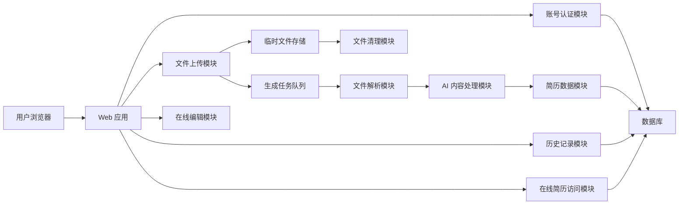

# 在线简历生成工具概要设计文档

## 1. 文档目的

本文档基于 `doc/proposal.md` 和已确认的补充需求，描述在线简历生成工具的概要设计，包括系统模块划分、模块职责、模块关系、核心流程和主要数据对象。

本文档不展开具体接口字段、数据库表结构、部署拓扑和第三方服务选型细节。

## 2. 设计边界

### 2.1 已确认范围

- 用户使用邮箱注册和登录。
- 支持上传 `.doc`、`.docx`、`.pdf` 简历文件。
- 单个上传文件大小上限为 15MB。
- 每个用户最多保留 3 份简历记录。
- 用户删除历史记录后，允许重新上传新的简历。
- 上传失败记录不保留。
- 不支持扫描版 PDF 或图片型 PDF 的 OCR。
- 需要尽量保留原始简历中的头像、图标、表格和复杂样式。
- 原始上传文件不长期保存。
- 解析不到内容时允许重试 2 次，仍失败则删除原始文件和本次失败任务数据。
- AI 负责结构识别、文案优化、合理补全和在线排版方案生成。
- AI 不得虚构学历、公司、岗位、项目、证书、工作年限等事实性经历。
- 在线编辑器支持撤销、重做和富文本编辑。
- 不允许用户切换简历模板。
- 不需要保存编辑历史或版本回退。
- 在线简历链接支持用户设置为公开访问、私密链接访问或密码访问。
- 用户不删除简历时，在线链接永久有效。
- 删除简历记录后，对应在线链接失效。
- 首期暂不统计在线简历访问次数。
- 需要隐私政策和用户协议页面。
- 首期不设置单份简历生成目标耗时。
- 需要排队机制处理解析和 AI 生成任务。

### 2.2 首期不包含

- 导出 PDF 或 Word。
- 多语言简历。
- 招聘方查看后台。
- 简历投递系统。
- 访问数据分析。
- 复杂模板市场。
- 付费订阅。
- 用户一键删除所有数据。

### 2.3 未知约束

- 首期预计用户规模未知，因此本文档不设定具体容量指标、并发指标和资源规格。

## 3. 总体架构

系统采用 Web 应用加后台异步任务的结构。前台负责账号、上传、编辑、历史记录和在线访问页面；后台任务负责文件解析、AI 内容处理和生成结果落库。

## 4. 模块划分

### 4.1 账号认证模块

职责：

- 提供邮箱注册、邮箱登录和退出登录能力。
- 维护用户身份状态。
- 校验当前用户是否有权限访问对应简历记录。
- 限制用户只能查看和编辑自己的历史记录。

与其他模块关系：

- 文件上传模块依赖账号认证模块识别上传用户。
- 历史记录模块依赖账号认证模块过滤当前用户数据。
- 在线编辑模块依赖账号认证模块校验编辑权限。
- 在线简历访问模块不暴露后台编辑权限。

### 4.2 用户协议与隐私页面模块

职责：

- 提供用户协议页面。
- 提供隐私政策页面。
- 在注册或必要操作前向用户展示相关协议入口。

与其他模块关系：

- 账号认证模块需要关联协议展示入口。
- 隐私政策内容需要覆盖简历文件、AI 请求、临时文件删除和在线链接访问规则。

### 4.3 文件上传模块

职责：

- 支持 `.doc`、`.docx`、`.pdf` 文件上传。
- 校验文件格式。
- 校验单个文件大小不超过 15MB。
- 校验每个用户最多保留 3 份简历记录。
- 当用户已有 3 份简历记录时，阻止继续上传，并提示用户删除已有记录后再上传。
- 将原始文件保存到临时文件存储。
- 创建生成任务并投递到任务队列。
- 上传失败时不保留失败记录。

与其他模块关系：

- 依赖账号认证模块获取当前用户。
- 依赖历史记录模块判断当前用户简历数量。
- 写入临时文件存储。
- 创建生成任务后交给任务队列处理。

### 4.4 临时文件存储模块

职责：

- 临时保存原始上传文件，仅用于解析和生成流程。
- 向文件解析模块提供文件读取能力。
- 在解析成功、生成失败终止或重试耗尽后删除原始文件。

与其他模块关系：

- 文件上传模块写入临时文件。
- 文件解析模块读取临时文件。
- 文件清理模块删除临时文件。

### 4.5 生成任务队列模块

职责：

- 保存上传、解析、AI 生成过程中的任务状态。
- 异步调度文件解析和 AI 内容处理。
- 支持解析不到内容时最多重试 2 次。
- 重试 2 次后仍失败时，将任务标记为失败并触发清理。
- 为前端提供生成进度和任务状态查询所需的数据。

任务状态建议包括：

- `pending`：等待处理。
- `parsing`：正在解析文件。
- `ai_processing`：正在进行 AI 内容处理。
- `completed`：生成完成。
- `failed`：生成失败。

与其他模块关系：

- 文件上传模块创建任务。
- 文件解析模块消费任务并更新解析状态。
- AI 内容处理模块消费解析结果并更新生成状态。
- 在线编辑模块在任务完成后读取生成结果。
- 文件清理模块根据任务终态清理原始文件。

### 4.6 文件解析模块

职责：

- 从原始上传文件中提取文本、结构和可保留的样式信息。
- `.docx` 直接解析文本、基础结构、图片、表格和可识别样式。
- `.pdf` 支持文本型 PDF 的内容提取，并尽量保留图片、表格和布局信息。
- `.doc` 先转换为 `.docx` 或文本后再解析。
- 不处理扫描版 PDF 或图片型 PDF 的 OCR。
- 当解析不到有效内容时，通知任务队列重试。

与其他模块关系：

- 从临时文件存储模块读取原始文件。
- 向 AI 内容处理模块输出解析后的文本、结构、图片和样式线索。
- 向生成任务队列模块更新解析状态和错误原因。

### 4.7 AI 内容处理模块

职责：

- 识别简历结构，如个人信息、教育经历、工作经历、项目经历、技能、证书、荣誉等。
- 对简历内容进行语言优化。
- 对表达不完整的内容进行基于已有信息的合理补全。
- 标记需要用户确认的不确定内容。
- 输出适合网页渲染的结构化简历数据。
- 生成固定模板体系下的在线排版方案。

约束：

- 不得虚构学历、公司、岗位、项目、证书、工作年限等事实性经历。
- 文件解析不完全依赖 AI，AI 只处理解析后的内容和结构线索。
- 首期 AI Provider 优先考虑 OpenAI API，并保留后续替换 AI Provider 的接口边界。

与其他模块关系：

- 接收文件解析模块的解析结果。
- 生成简历结构化内容并写入简历数据模块。
- 向生成任务队列模块更新 AI 处理状态。
- 向在线编辑模块提供可编辑的初始内容。

### 4.8 简历数据模块

职责：

- 保存生成后的结构化简历数据。
- 保存用户编辑后的最终内容。
- 保存在线网页渲染所需的数据。
- 维护简历记录与用户、在线链接、生成任务之间的关系。
- 不保存原始上传文件。

主要内容包括：

- 个人信息。
- 教育经历。
- 工作经历。
- 项目经历。
- 技能。
- 证书。
- 荣誉。
- 富文本内容。
- 样式和布局数据。
- 需要用户确认的 AI 补全提示。

与其他模块关系：

- AI 内容处理模块写入初始结构化内容。
- 在线编辑模块读取和更新简历内容。
- 历史记录模块读取简历摘要信息。
- 在线简历访问模块读取发布后的展示数据。

### 4.9 在线编辑模块

职责：

- 展示 AI 生成后的简历内容。
- 支持用户手动编辑个人信息、教育经历、工作经历、项目经历、技能、证书、荣誉等模块。
- 支持新增和删除简历模块。
- 支持调整模块顺序。
- 支持撤销和重做。
- 支持富文本编辑能力，包括加粗、链接和列表。
- 展示 AI 标记的不确定内容，提示用户确认。
- 保存编辑结果。
- 首期不支持模板切换。
- 首期不保存编辑历史或版本回退。

与其他模块关系：

- 依赖账号认证模块校验编辑权限。
- 读取和更新简历数据模块。
- 保存后触发或更新在线链接模块中的展示数据。

### 4.10 在线链接模块

职责：

- 在用户保存简历后生成在线简历链接。
- 支持公开访问、私密链接访问和密码访问三种访问模式。
- 用户未删除简历时，链接永久有效。
- 用户删除简历后，对应链接失效。
- 首期不统计访问次数。

访问模式说明：

- 公开访问：知道链接或通过公开入口均可访问。
- 私密链接访问：只有获得链接的人可以访问，不要求登录。
- 密码访问：访问者需要输入用户设置的访问密码。

与其他模块关系：

- 在线编辑模块保存后创建或更新在线链接。
- 在线简历访问模块根据链接配置判断访问权限。
- 历史记录模块展示在线链接。
- 删除简历记录时，历史记录模块通知在线链接失效。

### 4.11 在线简历访问模块

职责：

- 根据在线链接展示最终简历页面。
- 支持桌面端和移动端阅读。
- 根据在线链接访问模式执行访问控制。
- 不暴露编辑入口和后台权限。
- 当简历被删除或链接失效时，展示不可访问状态。

与其他模块关系：

- 读取在线链接模块的访问配置。
- 读取简历数据模块的展示数据。
- 不依赖账号认证模块提供编辑权限。

### 4.12 历史记录模块

职责：

- 为登录用户展示自己的简历历史记录。
- 展示简历标题、创建时间、最近更新时间、在线链接和编辑入口。
- 限制每个用户最多保留 3 个简历记录。
- 支持用户删除历史记录。
- 删除记录后允许用户重新上传新的简历。
- 删除记录时使对应在线链接失效。
- 不提供版本回退。

与其他模块关系：

- 依赖账号认证模块识别当前用户。
- 读取简历数据模块的摘要信息。
- 读取在线链接模块的链接信息。
- 删除记录时通知在线链接模块失效，并触发相关数据清理。

### 4.13 文件清理模块

职责：

- 在解析和生成流程结束后删除原始上传文件。
- 在解析不到内容且重试 2 次仍失败后，删除原始文件和本次失败任务数据。
- 确保原始文件不长期保存。

与其他模块关系：

- 读取生成任务队列模块的任务终态。
- 删除临时文件存储模块中的原始文件。

## 5. 核心流程

### 5.1 注册登录流程

1. 用户进入注册或登录页面。
2. 系统展示用户协议和隐私政策入口。
3. 用户使用邮箱完成注册或登录。
4. 系统建立用户身份状态。
5. 用户进入上传页面或历史记录页面。

### 5.2 简历上传与生成流程

1. 用户进入上传页面。
2. 系统校验用户当前简历记录数量是否少于 3 份。
3. 用户上传 `.doc`、`.docx` 或 `.pdf` 文件。
4. 系统校验文件格式和 15MB 大小限制。
5. 系统将文件写入临时文件存储。
6. 系统创建生成任务，并投递到任务队列。
7. 文件解析模块从队列中获取任务并解析文件。
8. 如果解析不到有效内容，任务最多重试 2 次。
9. 如果重试后仍失败，系统删除原始文件和失败任务数据，不保留失败记录。
10. 如果解析成功，AI 内容处理模块生成结构化简历数据和排版方案。
11. 系统保存生成后的简历数据。
12. 系统删除原始上传文件。
13. 用户进入在线编辑页面查看生成结果。

### 5.3 在线编辑与发布流程

1. 用户打开已生成的简历编辑页面。
2. 系统校验当前用户是否为简历所有者。
3. 用户编辑简历内容、富文本、模块顺序和模块增删。
4. 用户可以执行撤销和重做。
5. 用户确认 AI 标记的不确定内容。
6. 用户保存编辑结果。
7. 系统生成或更新在线链接。
8. 用户选择链接访问模式：公开访问、私密链接访问或密码访问。
9. 系统保存链接配置。

### 5.4 在线访问流程

1. 访问者打开在线简历链接。
2. 系统检查链接是否有效。
3. 如果简历已删除或链接已失效，系统展示不可访问状态。
4. 如果链接为密码访问，系统要求访问者输入密码。
5. 访问校验通过后，系统展示在线简历页面。
6. 首期不记录访问次数统计。

### 5.5 历史记录删除流程

1. 用户进入历史记录页面。
2. 用户删除某份简历记录。
3. 系统校验当前用户是否为简历所有者。
4. 系统删除或标记删除该简历记录。
5. 系统使对应在线链接失效。
6. 用户简历记录数量减少，可重新上传新的简历。

## 6. 数据对象

### 6.1 用户

用于保存账号身份信息。

关键属性：

- 用户 ID。
- 邮箱。
- 密码凭证。
- 创建时间。
- 最近登录时间。

### 6.2 简历记录

用于表示用户的一份在线简历。

关键属性：

- 简历 ID。
- 用户 ID。
- 简历标题。
- 创建时间。
- 最近更新时间。
- 删除状态。
- 生成任务 ID。
- 在线链接 ID。

### 6.3 简历结构化内容

用于保存 AI 提取和用户编辑后的内容。

关键属性：

- 简历 ID。
- 个人信息。
- 教育经历。
- 工作经历。
- 项目经历。
- 技能。
- 证书。
- 荣誉。
- 富文本内容。
- 模块顺序。
- 样式和布局数据。
- 待用户确认项。

### 6.4 在线链接

用于保存在线简历访问标识和访问配置。

关键属性：

- 链接 ID。
- 简历 ID。
- 访问标识。
- 访问模式。
- 密码凭证。
- 是否有效。
- 创建时间。
- 更新时间。

### 6.5 生成任务

用于保存上传、解析和 AI 生成过程状态。

关键属性：

- 任务 ID。
- 用户 ID。
- 简历 ID。
- 文件类型。
- 文件大小。
- 临时文件地址。
- 当前状态。
- 重试次数。
- 错误原因。
- 创建时间。
- 更新时间。

## 7. 模块关系汇总

| 模块 | 依赖模块 | 被依赖模块 |
| --- | --- | --- |
| 账号认证模块 | 用户数据 | 文件上传、在线编辑、历史记录 |
| 用户协议与隐私页面模块 | 无 | 账号认证 |
| 文件上传模块 | 账号认证、历史记录、临时文件存储、生成任务队列 | 用户浏览器 |
| 临时文件存储模块 | 无 | 文件上传、文件解析、文件清理 |
| 生成任务队列模块 | 文件上传、文件解析、AI 内容处理 | 前端进度查询、文件清理 |
| 文件解析模块 | 临时文件存储、生成任务队列 | AI 内容处理 |
| AI 内容处理模块 | 文件解析、生成任务队列 | 简历数据、在线编辑 |
| 简历数据模块 | 数据库 | 在线编辑、历史记录、在线简历访问 |
| 在线编辑模块 | 账号认证、简历数据、在线链接 | 用户浏览器 |
| 在线链接模块 | 简历数据 | 在线简历访问、历史记录 |
| 在线简历访问模块 | 在线链接、简历数据 | 访问者浏览器 |
| 历史记录模块 | 账号认证、简历数据、在线链接 | 文件上传 |
| 文件清理模块 | 生成任务队列、临时文件存储 | 无 |

## 8. 安全与隐私设计

- 所有编辑和历史记录接口必须校验用户身份和简历所有权。
- 在线访问页面与后台编辑页面必须使用不同权限模型。
- 在线链接不得暴露编辑权限。
- 密码访问模式下，系统不应明文保存访问密码。
- 原始上传文件只用于解析和生成流程。
- 原始文件在生成完成或失败终止后删除。
- AI 请求中只传递完成简历结构化、优化和排版所需的内容。
- 隐私政策需要说明简历数据使用方式、AI 服务使用方式、原始文件删除规则和在线链接访问规则。

## 9. 异常处理

### 9.1 上传异常

- 文件格式不支持时，直接拒绝上传。
- 文件超过 15MB 时，直接拒绝上传。
- 用户已有 3 份简历记录时，阻止上传并提示先删除历史记录。
- 上传失败时不保留失败记录。

### 9.2 解析异常

- 文本型 PDF、`.docx` 或转换后的 `.doc` 解析失败时，记录任务错误原因。
- 解析不到内容时最多重试 2 次。
- 重试后仍失败时，删除原始文件和失败任务数据，不保留失败记录。
- 扫描版 PDF 或图片型 PDF 不进入 OCR 流程。

### 9.3 AI 处理异常

- AI 调用失败时，任务状态应更新为失败。
- 前端应展示可理解的失败提示。
- 已保存的原始文件需要按清理规则删除。

### 9.4 在线访问异常

- 链接不存在、已失效或对应简历已删除时，展示不可访问状态。
- 密码访问模式下密码错误时，不展示简历内容。

## 10. 后续详细设计关注点

- 邮箱注册登录的验证方式和密码安全策略。
- `.doc` 转换工具选型。
- `.docx`、文本型 PDF 的解析库选型。
- 头像、图标、表格和复杂样式的可保留范围。
- AI 结构化输出 Schema。
- 任务队列实现方案。
- 在线编辑器数据结构。
- 富文本内容存储格式。
- 在线链接访问密码的存储和校验方式。
- 隐私政策和用户协议正文内容。
